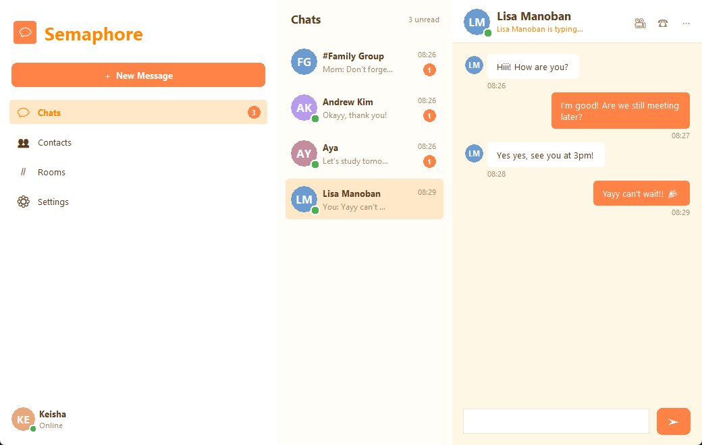

# Semaphore

An instant messaging system written in Python, from the raw TCP socket at the
bottom to end-to-end encrypted messages at the top, with a Tkinter interface
that lands last on purpose.

The server routes messages. It cannot read them.

> The repository is called **socket-to-ciphertext** after the arc it was built
> along — the raw socket at one end, encryption at the other. The application
> is called **Semaphore**. Built as coursework, in nine phases, each one ending
> in something that runs.

---

## What works today

**Two people can hold a conversation.** Start the server, run a client in two
terminals, and you have a working messenger:

```
$ python -m im.client --user alice --password hunter2 --register

  logged in as alice. /help for commands.

[nobody] > /to bob

  -- now talking to bob --

[bob] > hello bob 你好 🔐

  you: hello bob 你好 🔐

[bob] >
  bob: hi alice, this is bob
```

**Rooms work too.** `/create #general`, then anyone can `/join` it:

```
[#general] > /members

  #general: alice, bob, carol

[#general] > hello room

  you: hello room
  ... bob is typing
  bob: hi from bob
```

Also working: several conversations at once with separate unread counts, so
you can hold a 1:1 and a room chat side by side and see which has unread
messages; presence when someone logs in or drops; typing indicators; and
`/who`, `/chats`, `/history` and `/rooms`.

**It survives a restart.** Accounts, rooms, membership and message history
live in sqlite. Kill the server, start it again, log back in: anything sent
while you were away is delivered, and `/history` fetches the scrollback.

**Messages are encrypted end to end**, always — no flag required. The server
routes and stores ciphertext it holds no key for. Adding `--tls` on both ends
encrypts the framing and metadata as well, against third parties on the
network:

```
alice types :  the secret word is swordfish 🔐
bob reads   :  the secret word is swordfish 🔐
server holds:  LRg8O4SJrD//F9+Xh3AA2bCg3aH2bbz5u6+H2hp+uB4C1ZCv2sfK65mIhuMTRZHstQ==
```

**There is a window, too.** `--view tk` runs the graphical interface over the
same model as the console one:

```bash
python -m im.client --view tk --user aya --password pw --register
```



A navigation rail, a conversation list with unread counts and presence dots,
and a message pane with typing indicators. The composer is enabled only while
the connection is ONLINE.

**It survives the network going away.** A heartbeat notices a link that has
died without the socket closing, and the client reconnects and logs in again
by itself:

```
* connection RETRYING
  not connected; next attempt in 0.8s
  reconnect failed: could not reach 127.0.0.1:5821
  not connected; next attempt in 1.8s
* connection ONLINE
  reconnected as alice
```

What does **not** work yet: room messages are still sent in the clear, because
a frame carries one body and a room message would need one ciphertext per
member inside it.

| Phase | What it adds | State |
|-------|--------------|-------|
| 0 | Repo, package layout, toolchain | **done** |
| 1 | Sockets, framing, frozen protocol | **done** |
| 2 | Server core: registries, router, presence | **done** |
| 3 | Headless client: connection, model, console view | **done** |
| 4 | Rooms and concurrent conversations | **done** |
| 5 | Persistence, accounts, offline delivery | **done** |
| 6 | TLS and end-to-end encryption | **done** |
| 7 | Tkinter interface (design pass first) | **done** |
| 8 | Internet demo, hardening, report | hardening and report **done**; tunnel outstanding |

---

## Requirements

- **Python 3.11 or newer.** Enforced at import time — an older interpreter
  gets an explanation rather than a confusing `ImportError`.
- tkinter 8.6, bundled with the standard CPython installer on Windows and
  macOS. On Debian or Ubuntu: `sudo apt install python3-tk`. Not needed
  before the window existed.
- Everything else is in `requirements.txt`.

## Setup

```bash
git clone https://github.com/TurjoRahman-afk/socket-to-ciphertext.git
cd socket-to-ciphertext

python -m venv .venv
.venv\Scripts\activate          # Windows
source .venv/bin/activate       # macOS / Linux

pip install -r requirements.txt
```

## Running

```bash
python -m im.server                      # the hub, on 127.0.0.1:5000
python -m im.server --host 0.0.0.0       # reachable from other machines
python -m im.server --port 5050 --quiet
python -m im.server --db im.db            # where accounts and history live
python -m im.client --user alice --password pw --register
python -m im.client --host 192.168.1.20 --user bob --password pw
```

Both accept `--help`. Stop the server with Ctrl-C; it closes its listening
socket and hangs up on everyone cleanly.

## Talking to it without the client

The protocol is newline-delimited JSON, so any tool that speaks TCP will do.
Useful for seeing what actually goes over the wire. Start the server, then in
another terminal:

```bash
python - <<'PY'
import json, socket, time

def line(**f):
    return (json.dumps({"v": 1, **f}) + "\n").encode()

s = socket.create_connection(("127.0.0.1", 5000), timeout=5)
s.sendall(line(type="REGISTER", user="alice", pass_hash="pretend-digest"))
s.sendall(line(type="LOGIN",    user="alice", pass_hash="pretend-digest"))
time.sleep(0.3)
print(s.recv(65536).decode())
PY
```

Do the same in a third terminal as `bob`, then have alice send:

```python
s.sendall(line(type="MSG", to="bob", body="hello 你好 🔐"))
```

Bob's terminal receives the message with `"from": "alice"`, and alice gets an
`ACK`. `telnet 127.0.0.1 5000` works too — type prose and the server replies
with a `BAD_FRAME` error without hanging up on you.

---

## Architecture

### A hub, not peer-to-peer

Every client connects to one server, which routes between them. Offline
delivery, message history and presence all need somewhere central to live.
End-to-end encryption is what stops the hub reading what it routes, so
centralising delivery does not mean trusting the server with content.

### Threads, not asyncio

Chat is I/O-bound, so the GIL costs nothing here: a thread blocked in `recv()`
releases it. Threads are also a stated learning objective, and mixing an event
loop with Tkinter's own loop is genuinely awkward.

**Two threads per connection**, and one queue between them:

```
  client A                    SERVER                      client B
     |                                                       ^
     |  MSG                                                  |
     v                                                       |
  reader thread A ---> MessageRouter ---> outbox(B) ---> writer thread B
                       (pure logic,        queue.Queue
                        no sockets)        maxsize 1000
```

The router never touches a socket. It calls `send()`, which is `put_nowait`
and returns immediately, so **one client on a slow link cannot delay delivery
to anybody else**. The blocking write happens on a thread that connection owns
and nobody waits on.

Two rules hold the concurrency together:

- **The GIL is not a lock.** It makes a single dict operation atomic, but
  every registry operation is compound — *"is this name taken, and if not,
  claim it"* — so each one happens inside a single `threading.Lock` block.
- **Never send while holding a lock.** Registry methods that return a
  collection return a *copy*, so fan-out happens after the lock is released.
  Otherwise the slowest client sits on everyone else's critical path.

### The client is split so the interface can arrive last

```
  ServerConnection    socket thread, framing, connection state machine
        |
  ChatModel           conversations, roster, unread counts
        |             pure Python -- the word "tkinter" never appears here
  ChatController      gestures in, frames out; frames in, model updates out
        |
   +----+----+
 console    tk/       two interchangeable views over one model
                       both built, both working
```

`im/client/model/` may never import `tkinter`. That is not a convention —
[tests/test_model_has_no_tkinter.py](tests/test_model_has_no_tkinter.py)
parses every file in the package and fails the build if it ever does. The rule
is what lets the console view and the Tk view be two views over one model, and
it is the evidence behind the MVC claim in the report.

When the GUI does arrive, worker threads and widgets meet in exactly one
place: the reader thread pushes decoded frames onto a `queue.Queue`, and the
main thread drains it in a `root.after(50, poll)` loop. Tkinter has no
`SwingUtilities.invokeLater`, and calling a widget from a worker thread
corrupts state silently rather than raising.

---

## Protocol

One UTF-8 line per frame, one JSON object per line, `\n` as the delimiter.
Debuggable over telnet, readable in a packet trace during a demo.

```json
{"v":1,"id":"7f3a...","type":"MSG","ts":1756684800000,
 "from":"alice","to":"#general",
 "body":"BASE64-CIPHERTEXT","n":"BASE64-NONCE"}
```

TCP is a byte stream with no message boundaries: one `recv()` may return half
a frame, or three frames, or a frame split mid-character. `LineBuffer` in
[im/common/codec.py](im/common/codec.py) is the only place in the project that
has to care.

Implemented so far: `REGISTER`, `LOGIN`, `MSG`, `CREATE_ROOM`, `JOIN`,
`LEAVE`, `TYPING`, `PING`, and the server's `OK`, `LOGIN_OK`, `ACK`,
`ROOM_STATE`, `PRESENCE`, `PONG`, `ERROR`. Only `HISTORY`, `GET_KEY` and `KEY`
remain, and they land with persistence and encryption.

The full specification is in
[docs/protocol.md](docs/protocol.md). Changing anything in it needs agreement
from both tracks and a bump of `v`.

---

## Security

**Every message body is end-to-end encrypted**, direct messages and rooms
alike. The server routes and stores ciphertext it holds no key for.

- a direct message is sealed once, for its recipient
- a room message is sealed once **per member**, with a fresh nonce for each --
  two members share no key, and that pairing is what makes nonce reuse
  catastrophic
- a copy is sealed to the sender too, so your own history stays readable
- sealing is all or nothing: a missing key holds the message and fetches the
  key, rather than sending part of it in the clear

TLS is a **separate, optional** layer (`--tls` on both ends). It protects the
framing and metadata from third parties on the network. It does not protect
anything from the server, because that is where it terminates, and `run.bat`
does not pass it.

Alongside the encryption:

- passwords never travel or rest in plaintext — the client sends a digest,
  and the server compares it in constant time with `hmac.compare_digest`
- an unknown username and a wrong password produce the *same* error, so the
  server cannot be used to find out who has an account
- `from` is set by the server from the authenticated session, so a client
  cannot claim to be somebody else
- unauthenticated connections can do nothing but `PING`, `REGISTER`, `LOGIN`
- a client that never sends a newline is cut off at 1 MiB, and a client too
  slow to drain 1000 queued frames is disconnected rather than allowed to
  exhaust memory

The mechanism is an X25519 keypair per client, ECDH to HKDF to AES-GCM with a
fresh nonce per message. The private half never leaves the machine that
generated it.

**What this does not protect.** The server knows who talks to whom and when,
because it routes — with every body sealed, that metadata is the largest
remaining exposure. There is no forward secrecy and no key verification, so a
malicious server could substitute a public key and read everything. Searching
is client-side over what has been decrypted, because the server cannot read
what it stores. All of it is written down without hedging in
[docs/threat-model.md](docs/threat-model.md), including the fact that an
earlier version of that file claimed room encryption before it existed.

---

## Tests and tooling

```bash
pytest                  # 316 tests; a hung test fails after 30s
pytest --cov            # coverage, for the report
pytest tests/test_router.py   # routing rules, no sockets, instant
ruff check .            # lint
ruff format .           # format
```

The suite is split by what each part needs to run. `test_codec.py`,
`test_router.py`, `test_model.py` and `test_crypto.py` touch no network and
finish in milliseconds; `test_connection.py` and `test_integration.py` open
real sockets. When something breaks you know immediately whether it is your
logic or your networking.

`test_integration.py` is the heavy end: three clients in a room, fifty
messages checked for ordering, twenty clients connected at once, and ten
clients each sending ten messages into one room simultaneously with every
message required to arrive exactly once. It also kills a server mid-session
and checks the client reconnects by itself.

`pytest-timeout` matters more here than in most projects: this is threads and
blocking sockets, where the natural failure mode is a deadlock rather than an
exception, and without a timeout a hung test blocks forever instead of
failing. It has already caught one.

---

## Layout

```
docs/          protocol spec, threat model, design report
im/common/     frames, codec, ids -- shared by both sides of the wire
im/crypto/     X25519 identity, AES-GCM envelope, TLS helpers
im/server/     accept loop, per-client handler, router, registries, store
im/client/     net, model, controller, views
tests/
```

`im/server/` and `im/client/` never import each other. They agree only
through `im/common/` and the protocol document.

## Design decisions

| Decision | Why |
|---|---|
| Threads, not asyncio | Stated objective; chat is I/O-bound; asyncio plus Tk's loop is awkward |
| Raw TCP, not WebSocket | Writing the framing *is* the exercise; a tunnel handles the internet demo |
| Hub, not peer-to-peer | Offline delivery, history and presence need a centre; E2EE keeps it blind |
| Newline-delimited JSON | Debuggable with telnet before any GUI exists |

## Known limitations

Stated plainly, because an overclaim a marker can puncture is worth less than
an honest boundary.

- **Room messages are not encrypted.** A frame carries one body, so a room
  message would need one ciphertext per member inside it. Direct messages are
  end-to-end encrypted; room messages are protected by TLS alone, which means
  the server can read them.
- **No forward secrecy.** Compromising a long-term private key exposes past
  messages. Real systems ratchet; this one does not.
- **No key verification.** A malicious server could substitute its own public
  key in a `GET_KEY` reply and read everything. Mitigating that needs an
  out-of-band fingerprint check.
- **The private key file is not encrypted at rest.** Anyone with the unlocked
  machine can read it.
- The server learns who talks to whom and when. That is metadata, and only Tor
  or a mixnet would hide it.
- One username can only be connected once at a time.
- No rate limiting, and no cap on the number of accounts.
- The development certificate is self-signed, so a client must be told to
  trust it. A real deployment needs one from a certificate authority.

## Documentation

- [docs/protocol.md](docs/protocol.md) — the wire format
- [docs/threat-model.md](docs/threat-model.md) — what the encryption will and will not protect
- [docs/design.md](docs/design.md) — the submitted report
